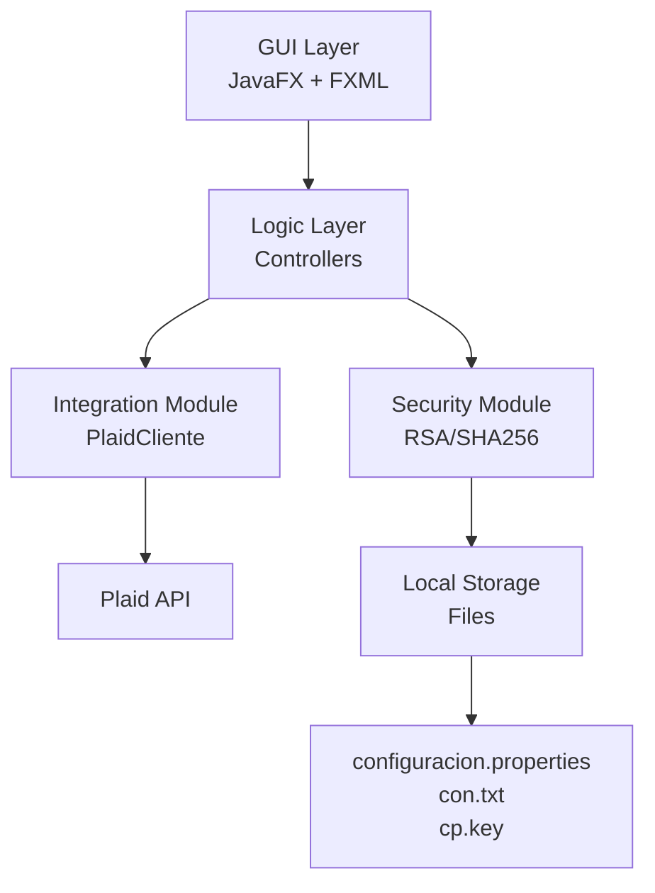

# Manual Técnico - OpenTrackBank

## Descripción del Proyecto

OpenTrackBank es una aplicación de seguimiento bancario personal desarrollada en Java utilizando JavaFX para la interfaz gráfica. El sistema permite a los usuarios autenticarse de forma segura, conectar sus cuentas bancarias a través de la API de Plaid y visualizar saldos, transacciones y presupuestos de manera intuitiva. El proyecto está en fase de Mínimo Producto Viable (MVP), con funcionalidades básicas implementadas y otras pendientes.

## Arquitectura del Sistema

El sistema sigue un patrón arquitectónico MVC (Modelo-Vista-Controlador) con separación clara de capas:

- **Capa de Presentación**: Utiliza JavaFX con FXML para definir la estructura de la interfaz y CSS para los estilos. Incluye controladores que manejan la lógica de la UI.
- **Capa de Lógica**: Controladores y servicios que gestionan la lógica de negocio, integración con APIs externas y operaciones de seguridad.
- **Capa de Datos**: Integración con la API de Plaid para datos bancarios y almacenamiento local de configuraciones y claves de seguridad.

### Diagrama de Arquitectura



### Módulos y Responsabilidades

- **GUI (org.taulyd.gui)**: Gestiona la interfaz de usuario, navegación entre escenas y controladores de vistas.
- **Seguridad (org.taulyd.seguridad)**: Maneja la criptografía, generación y validación de claves RSA, y hashing de contraseñas.
- **Torrente (org.taulyd.torrente)**: Integración con Plaid API para recuperar cuentas y transacciones, y gestor local para almacenamiento persistente.
- **Model (org.taulyd.model)**: Define enums para temas e idiomas.

## Dependencias y Versiones

- **Lenguaje**: Java 25 (preview)
- **Framework UI**: JavaFX 26 (early-access)
- **Build Tool**: Maven
- **Integración Bancaria**: Plaid Java SDK 39.4.0
- **Plugins Maven**:
  - maven-compiler-plugin: Para compilación
  - maven-shade-plugin: Para crear JAR fat
  - javafx-maven-plugin: Para ejecutar JavaFX
  - jlink-maven-plugin: Para runtime modular
  - jpackage-maven-plugin: Para generar instalables nativos

## Estructura del Repositorio

```
OpenTrackBank/
├── src/
│   ├── main/
│   │   ├── java/org/taulyd/
│   │   │   ├── App.java                 # Punto de entrada principal
│   │   │   ├── gui/                     # Controladores de interfaz
│   │   │   ├── model/                   # Modelos de datos
│   │   │   ├── seguridad/               # Módulo de seguridad
│   │   │   └── torrente/                # Integración bancaria
│   │   └── resources/                   # Recursos estáticos
│   │       ├── FXML/                    # Archivos de interfaz
│   │       ├── CSS/                     # Hojas de estilo
│   │       └── Iconos_Imagenes/         # Imágenes e iconos
│   └── test/                            # (No existe actualmente)
├── target/                              # Archivos compilados
├── pom.xml                              # Configuración Maven
├── README.md                            # Documentación básica
└── docs/                                # Carpeta de documentación
    └── ManualTecnico.md                 # Este manual
```

## Funcionalidades Principales

### Autenticación
- Inicio de sesión con contraseña maestra (hash SHA256).
- Generación y validación de claves RSA para autenticación dual.
- Registro de nuevos usuarios.

### Dashboard Principal
- Visualización de cuentas conectadas con saldos actuales y disponibles.
- Lista de transacciones de los últimos 7 días.
- Navegación entre diferentes vistas.

### Configuración
- Cambio de tema (claro/oscuro).
- Selección de idioma (estructura preparada, no funcional).
- Backup de claves públicas.

### Integración Bancaria
- Conexión a Plaid API para recuperar cuentas y transacciones.
- Procesamiento asíncrono para no bloquear la UI.

### Otras Funcionalidades
- Panel de presupuestos (interfaz diseñada, lógica pendiente).
- Módulos adicionales como categorías y notas (no implementados).

No hay API REST expuesta; todas las funcionalidades son a través de la interfaz gráfica.

## Base de Datos

El sistema no utiliza una base de datos tradicional. En su lugar, emplea almacenamiento local basado en archivos:

- **configuracion.properties**: Configuraciones de usuario (tema, idioma).
- **con.txt**: Hash de la contraseña maestra.
- **cp.key**: Clave privada RSA serializada.
- **publicKey.key**: Clave pública exportada.

Los datos bancarios se obtienen en tiempo real desde la API de Plaid y no se almacenan localmente de forma persistente.

## Pruebas

Actualmente, no hay pruebas automatizadas implementadas. El directorio `src/test/` no existe. Se recomienda implementar pruebas unitarias con JUnit 5, pruebas de integración con mocks de Plaid, y pruebas de UI con TestFX.

Para ejecutar pruebas manuales, se requieren credenciales válidas de Plaid API, que actualmente están vacías.

## Problemas Conocidos y Limitaciones Actuales

- **Credenciales Plaid Vacías**: La integración bancaria no funciona sin credenciales válidas.
- **Almacenamiento Inseguro**: La contraseña se almacena como hash sin cifrado adicional.
- **Validación RSA Incompleta**: La verificación de claves no es robusta.
- **Threads sin Timeout**: Pueden bloquear la UI si la API no responde.
- **Controladores Faltantes**: Algunos FXML no tienen controladores implementados.
- **Internacionalización No Funcional**: El cambio de idioma no afecta la UI.
- **Sin Pruebas**: Falta cobertura de testing.
- **Sin Logging**: Solo se usa System.err para debug.

## Próximos Pasos

Para completar el MVP y preparar la defensa final:

1. **Corregir Bloqueadores Críticos**: Configurar credenciales Plaid, implementar controladores faltantes, mejorar seguridad.
2. **Completar Funcionalidades**: Implementar presupuestos, categorías, notas y detalles de transacciones.
3. **Agregar Testing**: Suite completa de pruebas unitarias e integración.
4. **Mejorar Seguridad**: Cifrado de archivos, KeyStore, logging.
5. **Internacionalización**: Implementar soporte real para múltiples idiomas.
6. **Deployment**: CI/CD, perfiles Maven, versionado.

